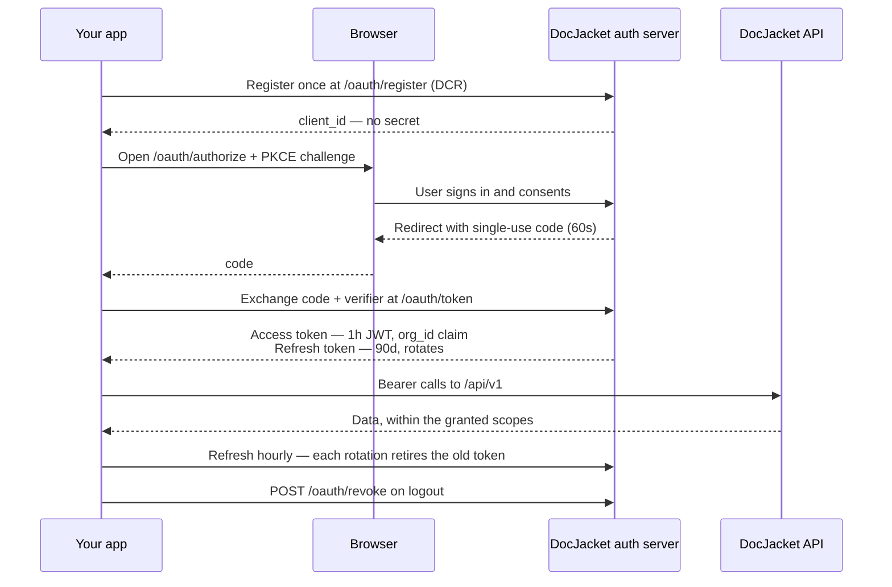

<head>
<script type="application/ld+json">
{JSON.stringify({
  "@context": "https://schema.org",
  "@type": "FAQPage",
  "mainEntity": [
    {
      "@type": "Question",
      "name": "What kind of authentication does DocJacket's MCP server use?",
      "acceptedAnswer": {
        "@type": "Answer",
        "text": "OAuth 2.1 with PKCE and Dynamic Client Registration (RFC 7591). No static API keys, no shared secrets. Every assistant registers itself, every user grants consent individually, every token is bound to one user and one assistant."
      }
    },
    {
      "@type": "Question",
      "name": "How long does an OAuth access token last?",
      "acceptedAnswer": {
        "@type": "Answer",
        "text": "Access tokens are valid for one hour. Refresh tokens last 90 days and rotate on every exchange — the previous one is retired to limit replay damage, with a short grace period so two sessions refreshing at the same moment don't knock each other out."
      }
    },
    {
      "@type": "Question",
      "name": "How do I revoke an assistant's access?",
      "acceptedAnswer": {
        "@type": "Answer",
        "text": "Go to DocJacket → Settings → API & AI Access, find the assistant in the connected-clients list, and click Revoke. The next request from that client returns 401 Unauthorized; the user will have to re-consent if they want to reconnect."
      }
    },
    {
      "@type": "Question",
      "name": "What are scopes, and why does the consent screen ask about read, draft, and actions?",
      "acceptedAnswer": {
        "@type": "Answer",
        "text": "Scopes are coarse permission buckets, and all three are live and enforced per token. Read covers searching and viewing data. Draft lets an assistant prepare emails or task suggestions for your approval — nothing sends. Actions covers sending and modifying on your behalf, with per-action confirmation. The tier you grant at consent is exactly what the token can do."
      }
    }
  ]
})}
</script>
</head>

# How the OAuth flow works

DocJacket's MCP server is OAuth 2.1 + PKCE + Dynamic Client Registration (RFC 7591). If you've connected an assistant by pasting a URL, what you saw was the discovery / consent dance below — six HTTP requests, ~1 second end-to-end, no keys to manage.

This page is for the curious and for the security-conscious. **You don't need to read it to use AI Access** — the consent screen is the only step you ever interact with.

**Building an app on the [Developer API](/docs/api)?** Then you do need this page, and it's the flow you want — start with the **[Build an app quickstart](/docs/api/build-an-app)**, which walks the whole thing with runnable requests. The tokens below work on the REST API exactly as they do on MCP — same `Authorization: Bearer …` header, same scopes — so an app that connects many customer accounts registers once here rather than asking each customer to mint and paste a key.

## See it in action

<div style={{position: 'relative', paddingBottom: '62.5%', height: 0, margin: '1.5rem 0', borderRadius: '8px', overflow: 'hidden'}}>
  <iframe
    src="https://www.loom.com/embed/5731759ff555447c9b627b4a9c31dae4?hideEmbedTopBar=true"
    title="OAuth flow in action — connecting Claude to DocJacket in 30 seconds"
    frameBorder="0"
    allowFullScreen
    style={{position: 'absolute', top: 0, left: 0, width: '100%', height: '100%'}}
  />
</div>

The 30-second walkthrough above is the entire flow: paste URL → consent screen → Allow → tools loaded. Everything below explains what happens under the hood.

Prefer stills? The stepped version walks the same journey from the end user's seat — sign-in, consent, the connection appearing under **Connected agents**, and one-click revoke:

<div style={{ position: 'relative', width: '100%', aspectRatio: '16 / 9', margin: '1.5rem 0' }}>
  <iframe
    src="https://app.supademo.com/embed/cmtagv2c10001pu1z5g0klwa6?embed_v=2"
    title="What your customer sees — OAuth consent, step by step"
    allow="fullscreen"
    allowFullScreen
    loading="lazy"
    style={{ position: 'absolute', inset: 0, width: '100%', height: '100%', border: 0, borderRadius: 8 }}
  />
</div>

## The flow at a glance



Each step in detail:

## 1. Discovery

When you paste `https://mcp.docjacket.com/mcp` into your assistant, the first thing it does is fetch two well-known metadata documents:

- **Protected resource metadata** (`https://mcp.docjacket.com/.well-known/oauth-protected-resource`) tells the assistant where to find the authorization server.
- **Authorization server metadata** (`https://app.docjacket.com/.well-known/oauth-authorization-server`) tells the assistant which endpoints to use for registration, authorization, and token exchange.

This is RFC 9728 + RFC 8414 — the standard auth-server discovery pattern. No proprietary configuration files.

## 2. Dynamic Client Registration (RFC 7591)

The assistant POSTs to `https://app.docjacket.com/oauth/register` with its name, redirect URIs, and what it wants to do. DocJacket creates a fresh `client_id` (prefixed `dyn_`) and returns it.

This is the magic that makes paste-URL-and-go work: the assistant **registers itself** the first time you connect. There's no DocJacket admin console where you create API credentials and copy-paste them.

Every assistant gets its own `client_id` — your Claude.ai connector and your Codex CLI have different ones.

## 3. Authorize

The assistant redirects you to:

```
https://app.docjacket.com/oauth/authorize
  ?response_type=code
  &client_id=dyn_...
  &redirect_uri=https://claude.ai/api/mcp/auth_callback
  &code_challenge=...                ← PKCE
  &code_challenge_method=S256
  &state=...
  &scope=read+draft+actions
  &resource=https://mcp.docjacket.com/mcp
```

If you're not already logged into DocJacket in that browser session, you'll be sent to the login page first and bounced back here after.

## 4. Consent

You see DocJacket's consent screen:

> **Connect [Claude] to DocJacket?**
>
> This will let the app act on data in your organization.
>
> It will be able to:
> - **read** — Read your transactions, tasks, key dates, and contacts.
> - **draft** — Prepare emails and task suggestions for your approval. (Nothing sends without your review.)
> - **actions** — Send communications and make changes on your behalf. (Per-action confirmation still applies.)

Clicking **Allow** redirects you back to the assistant with a one-time authorization code.

## 5. Token exchange

The assistant POSTs the auth code to `https://app.docjacket.com/oauth/token` along with the PKCE verifier (proving it's the same client that started the flow). DocJacket returns:

- **access_token** — a signed JWT, valid 1 hour, bound to your user, your org, the client, and the resource indicator
- **refresh_token** — opaque token (prefixed `mcp_rt_`), valid 90 days, single-use (rotates on every exchange)

## 6. Tool calls

The assistant now POSTs to `https://mcp.docjacket.com/mcp` with `Authorization: Bearer <access_token>` and a JSON-RPC body. DocJacket validates the JWT (issuer, audience, signature, expiry) and runs the tool.

If the token is missing or invalid, DocJacket returns **HTTP 401** with a `WWW-Authenticate: Bearer ... resource_metadata=...` header so the assistant can re-discover and re-authenticate.

## Scopes

DocJacket exposes three scopes — all live, all enforced per token:

| Scope | What it covers |
|---|---|
| `read` | Search transactions, get details, list deadlines, contingencies, missing docs, contacts |
| `draft` | Prepare emails and task suggestions for your approval. Nothing sends. |
| `actions` | Send communications and make changes on your behalf, with per-action confirmation |

The tier you grant at consent is exactly what the token can do — tiers are checked exactly, not hierarchically, and a client registered for a narrower scope can never request a wider one.

## Refresh + rotation

When the access token expires (1h), the assistant exchanges the refresh token for a new pair. The old one is retired in the same breath — this is **single-use refresh** per OAuth 2.1.

**Running the same assistant in two places at once is fine.** Tools like the Codex CLI can have several processes sharing one saved credential, and they often refresh at the same moment: one wins the race and rotates the token, the other arrives a second later holding what is now the old one. For a short window after a rotation, presenting the just-used token again is treated as what it almost always is — a second session catching up, or a retry after a dropped response — and that caller is handed its own fresh token. Both sessions keep working, and neither is signed out.

Outside that window, re-presenting a spent refresh token is treated as a leaked credential: DocJacket revokes the whole chain of tokens descended from it, and the assistant falls back to re-consent. That is the intended protection — if someone copies your refresh token, the moment either of you uses it after the other, the entire chain dies rather than quietly serving you both.

Nothing here needs configuring. If an assistant does end up asking you to reconnect, the fix is the same as it has always been: consent again.

## Revocation

**DocJacket → Settings → API & AI Access → Connected Clients.** Click **Revoke** on any client.

What happens:

1. The token row's `revoked_at` is set in our database immediately.
2. The next tool call returns HTTP 401 with the same WWW-Authenticate challenge as an unauthenticated request.
3. The assistant either falls back to re-consent (if you want to reconnect) or fails gracefully (if you don't).

There's no propagation delay — revocation is enforced on the next request.

## Resource indicators (RFC 8707)

Notice the `resource=https://mcp.docjacket.com/mcp` parameter in the authorization URL. This is RFC 8707 — the access token's `aud` (audience) claim is bound to this resource URL. A token issued for one MCP server can't be replayed against another (e.g., a stolen Claude.ai token can't be used against a different MCP service).

## When you'd skip OAuth and use a token instead

A few clients don't (yet) support paste-URL OAuth and need a personal access token instead:

- **Cowork** — org-installed plugin; a long-lived token is the right primitive for org-wide install. ([setup](/docs/ai-access/cowork))
- **Gemini CLI** — Dynamic Client Registration support isn't shipped on Gemini's MCP client yet. ([setup](/docs/ai-access/gemini))
- **Codex CLI** — works either way; many users prefer the token + `codex secret set` flow. ([setup](/docs/ai-access/codex))
- **Your own scripts and back-office tools** — when the account is yours, a token you paste into your `Authorization: Bearer …` header is simpler than a consent flow, and there is nobody to ask for consent anyway.

This is about *whose* account you're reaching, not about REST versus MCP. If you're building something that connects **other people's** accounts — an app you ship to customers — use OAuth, on either surface. A key per customer means storing their credentials and minting one by hand for every signup.

Mint tokens at [app.docjacket.com/settings/api-access](https://app.docjacket.com/settings/api-access). They scope per-org, can be labeled, and can be revoked independently of OAuth-issued tokens.

## What we never see

DocJacket never sees or stores:

- The contents of conversations you have with your assistant
- The internal model the assistant is using
- Other tools or connectors the assistant calls

We only see the MCP requests for OUR server: tool name, arguments, latency, outcome. That's it — and it's all in your AI Access activity log.

## Need help?

If OAuth fails, the assistant will show a reference ID on the error screen. Send it to <a href="mailto:support@docjacket.com">support@docjacket.com</a> and we can correlate it with our diagnostic logs (we log every JWT validation failure, every token grant, and every consent decision).
