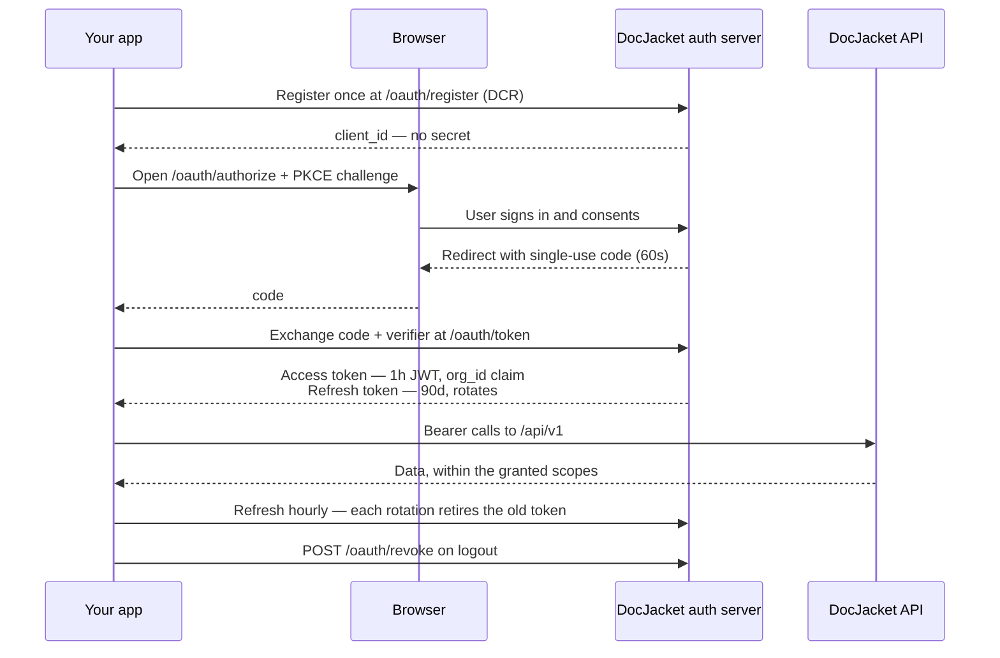
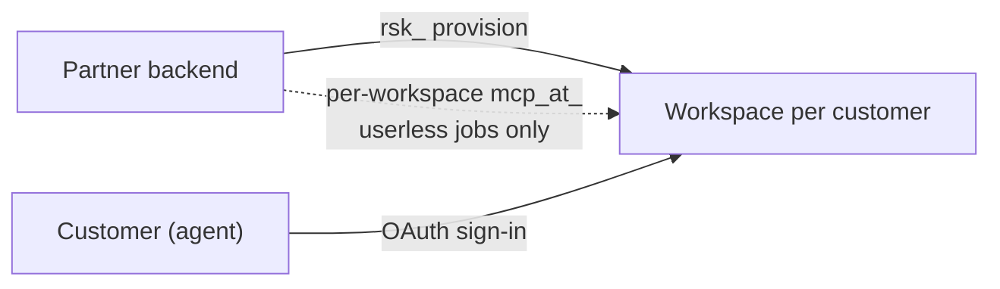

<!-- Canonical: https://help.docjacket.com/docs/api/build-an-app -->
<!-- Source: docs/api/build-an-app.mdx -->

# Build an app on the API

This is the page for anyone shipping something **other people sign in to** — a mobile app, a customer portal, an integration you sell. By the end your app has its own identity, each of your users authorizes their own DocJacket account, and your code never stores a customer credential.

If you're only automating **your own** workspace, you don't need any of this — mint a [workspace API key](./authentication.mdx#create-a-key) and start calling. And if you're not sure which situation you're in, start at [Which credential do I need?](./index.mdx#which-credential-do-i-need)

## Step 0 — Explore with a key first

You don't need OAuth wired up to start building. Mint a workspace API key in a workspace you control (**Settings → Advanced → API & AI Access → API keys**) and use it while you develop:

```bash
# Does my credential work? Echoes the workspace + granted scopes.
curl https://api.docjacket.com/api/v1/health \
  -H "Authorization: Bearer mcp_at_YOUR_DEV_KEY"

# Every operation, with a `callable` flag for this credential.
curl https://api.docjacket.com/api/v1/catalog \
  -H "Authorization: Bearer mcp_at_YOUR_DEV_KEY"
```

Everything you build this way carries over unchanged: OAuth tokens call **the same endpoints with the same `Authorization: Bearer …` header** and return the same responses. Build your data layer against the key, then swap the auth layer in Step 3 — nothing else moves.

Generate a typed client from the machine-readable spec at [api.docjacket.com/openapi.json](https://api.docjacket.com/openapi.json), and keep the [live reference](https://api.docjacket.com/reference) open while you work.

## The whole flow at a glance



Steps 1–6 below walk that flow with runnable requests.

## Step 1 — Discover the endpoints

Never hardcode OAuth URLs — fetch them:

```bash
curl https://app.docjacket.com/.well-known/oauth-authorization-server
```

The response names the registration, authorization, token, and revocation endpoints used below, plus the supported scopes. (Standard RFC 8414 — most OAuth client libraries consume this document directly.)

## Step 2 — Register your app (once)

```bash
curl -X POST https://app.docjacket.com/oauth/register \
  -H "Content-Type: application/json" \
  -d '{
    "client_name": "Your App Name",
    "redirect_uris": ["yourapp://auth"],
    "scope": "read draft actions"
  }'
```

Back comes a `client_id` (prefixed `dyn_…`) — and **no secret**. This is a *public client*: the `client_id` is an identifier, not a credential, so it's safe to ship inside a mobile binary. The credential is always the user's sign-in, never the app.

Worth knowing:

- **Redirect URIs** can be a mobile custom scheme (`yourapp://auth`), an https URL, or a localhost URL — up to five per client. Register a **separate dev client** with your development redirect URIs so your production client stays clean.
- **The scope you register is a ceiling.** A client registered with `scope: "read"` can never obtain `draft` or `actions`, no matter what it asks for later. Register what the app will actually need.
- Registrations that never complete a sign-in are cleaned up automatically after 30 days — a throwaway dev registration costs nothing.

## Step 3 — Sign a user in

Your app opens the **system browser** (not a WebView) at the authorization endpoint, with a PKCE challenge:

```
https://app.docjacket.com/oauth/authorize
  ?response_type=code
  &client_id=dyn_YOUR_CLIENT_ID
  &redirect_uri=yourapp://auth
  &scope=read+draft+actions
  &code_challenge=BASE64URL(SHA256(verifier))
  &code_challenge_method=S256
  &state=OPTIONAL_OPAQUE_VALUE
```

The user signs in with their normal DocJacket login, sees a consent screen naming your app and the scopes, and clicks **Allow**. The browser redirects to `yourapp://auth?code=…` — a **single-use code valid for 60 seconds**, so exchange it immediately.

PKCE is mandatory and `S256`-only. Every mainstream OAuth library (AppAuth, expo-auth-session, oauth2 crates/gems/packages) handles the verifier/challenge pair for you.

## Step 4 — Exchange the code for tokens

```bash
curl -X POST https://app.docjacket.com/oauth/token \
  -H "Content-Type: application/x-www-form-urlencoded" \
  -d grant_type=authorization_code \
  -d code=THE_CODE \
  -d redirect_uri=yourapp://auth \
  -d client_id=dyn_YOUR_CLIENT_ID \
  -d code_verifier=THE_PKCE_VERIFIER
```

You receive:

- **`access_token`** — a JWT valid for **1 hour**. Its claims carry the user (`sub`), their workspace (`org_id`), a display name and workspace name for your UI, and the granted scopes.
- **`refresh_token`** — opaque (`mcp_rt_…`), valid **90 days**, single-use.

**Key your storage on the token's `org_id` claim.** That's which workspace this user belongs to — it *is* your multi-tenancy. A user from workspace A can never see workspace B's data, because their token simply is workspace A.

## Step 5 — Call the API

Same header, same endpoints as a key:

```bash
curl https://api.docjacket.com/api/v1/tasks \
  -H "Authorization: Bearer ACCESS_TOKEN_JWT"
```

Everything in [All operations](./reference.mdx) — transactions, tasks, key dates, documents, messaging, disclosures — accepts the token, subject to its scopes.

## Step 6 — Refresh, logout, and the two rules

Refresh before or at expiry:

```bash
curl -X POST https://app.docjacket.com/oauth/token \
  -H "Content-Type: application/x-www-form-urlencoded" \
  -d grant_type=refresh_token \
  -d refresh_token=mcp_rt_CURRENT \
  -d client_id=dyn_YOUR_CLIENT_ID
```

On logout, actually revoke — don't just forget the token:

```bash
curl -X POST https://app.docjacket.com/oauth/revoke \
  -H "Content-Type: application/x-www-form-urlencoded" \
  -d token=mcp_rt_CURRENT
```

The two rules that prevent the two most common production incidents:

1. **Refresh tokens rotate.** Every refresh returns a new one and retires the old. Store the new token *before* using it, and never retry a failed refresh with the old one — outside a short race-grace window, re-presenting a spent refresh token is treated as a stolen credential and disconnects that user's whole token chain (deliberately).
2. **A `401` means "reconnect this account," not "retry."** Membership is re-checked on every call, so a user removed from a workspace loses access mid-session, before their token expires. Route them back through Step 3.

## If you're a white-label partner

Your [partner key](./reseller.mdx) (`rsk_…`) keeps its job — server-side provisioning: creating a workspace for each new customer, inviting seats. It never reads deal data. The flow composes cleanly with the steps above: your signup flow provisions the workspace with the partner key, the new customer completes their first sign-in, and from then on your app acts as them via their own token.

A per-workspace `mcp_at_` key enters only if your backend needs to run jobs against a workspace **with no user signed in** (nightly syncs, batch imports). If you have that need, [tell us](mailto:support@docjacket.com) — don't build a key-collection habit preemptively.



## Deeper reading

- [How OAuth works](/docs/ai-access/oauth) — the protocol end-to-end: discovery, DCR, consent, rotation internals, resource indicators, revocation semantics.
- [Making requests](./making-requests.mdx) — conventions, errors, rate limits.
- [Webhooks](./webhooks.mdx) — get events pushed instead of polling.
